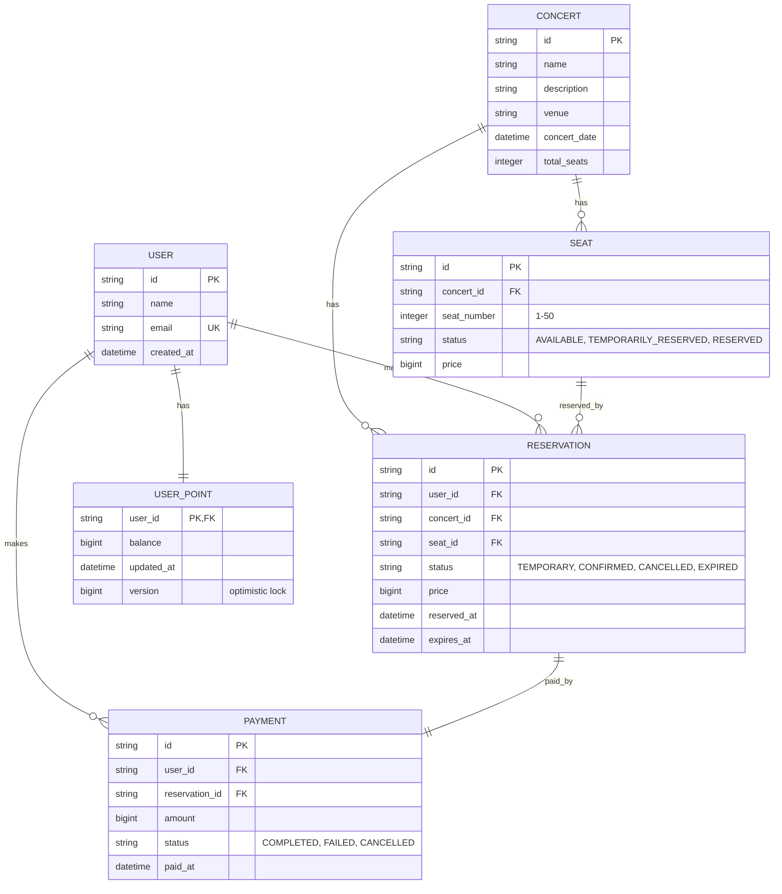

# 콘서트 예약 시스템 ERD

## Entity Relationship Diagram

## 테이블 설명

### CONCERT (콘서트)
- 콘서트 정보와 공연 날짜를 함께 저장
- 같은 콘서트라도 날짜가 다르면 별도의 Concert 레코드로 관리
- 공연장 정보 포함
- 총 좌석 수 저장
- 각 콘서트마다 좌석(seat) 정보 관리

### SEAT (좌석)
- 특정 콘서트의 좌석 정보 (1-50번)
- 상태: AVAILABLE(예약 가능), TEMPORARILY_RESERVED(임시 예약), RESERVED(예약 완료)
- concert_id + seat_number 조합 Id

### USER (사용자)
- 시스템 사용자 정보
- 이메일 유니크 제약조건

### USER_POINT (사용자 포인트)
- 사용자별 포인트 잔액 관리
- version 컬럼을 통한 낙관적 락(Optimistic Lock) 적용
- 동시성 제어를 위해 버전 관리

### RESERVATION (예약)
- 좌석 예약 정보
- 상태: TEMPORARY(임시, 5분), CONFIRMED(확정), CANCELLED(취소), EXPIRED(만료)
- 임시 예약 시 5분 후 자동 만료 (expires_at)
- 결제 완료 시 CONFIRMED 상태로 변경

### PAYMENT (결제)
- 예약에 대한 결제 정보
- 상태: COMPLETED(완료), FAILED(실패), CANCELLED(취소)
- 결제 완료 시 예약이 확정되고 좌석 소유권 배정
